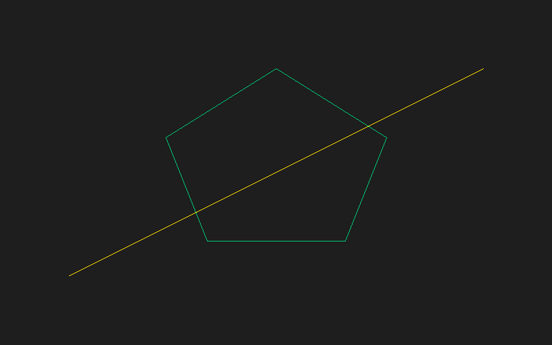

# Lab 1 — Computer Graphics

A basic rasterizer written in Rust, without using the drawing functions of any
graphics library. Everything is drawn pixel by pixel into a custom framebuffer
and exported to an image file.



## What it does

Implements the full chain of drawing primitives from scratch, each one built on
top of the previous:

| Primitive | Implementation |
|---|---|
| **Point** | Writes a pixel directly into the framebuffer |
| **Line** | **Bresenham's** algorithm (integer only, no floats inside the loop) |
| **Polygon** | Closed outline: a line between each pair of consecutive vertices |
| **Fill** | **Scanline** algorithm, filling between sorted pairs of intersections |

The final drawing has 5 polygons: a star, a diamond, a triangle and a teapot.
**Polygon 5 is a hole** inside the teapot — it is drawn by filling it with the
background color, and the outlines are traced *after* every fill so the hole
does not erase the border of polygon 4.

## Structure

```
src/
├── main.rs          Defines the 5 polygons and composes the scene
├── framebuffer.rs   Pixel buffer + BMP and PNG exporters
├── point.rs         point()  -> set_pixel
├── line.rs          line()   -> point()
└── polygon.rs       polygon() and fill_polygon() -> line()
```

Outputs: `out.bmp` and `out.png` (same image, 800x500).

> The Y axis grows upwards: `y = 0` is the bottom row (math-style coordinates).
> The PNG exporter flips Y explicitly; the BMP one does not need to, since the
> format already stores its rows bottom-up.

## Requirements

- **Rust 1.85+** (the project uses edition 2024)
- **CMake** — `raylib-sys` builds raylib from C source
- **A C/C++ compiler** — MSVC Build Tools on Windows
- **LLVM / libclang** — required by `bindgen` to generate the raylib bindings

On Windows, using [winget](https://learn.microsoft.com/windows/package-manager/):

```powershell
winget install --id Kitware.CMake
winget install --id LLVM.LLVM
winget install --id Microsoft.VisualStudio.2022.BuildTools --override "--quiet --add Microsoft.VisualStudio.Workload.VCTools --includeRecommended"
```

If `bindgen` cannot find libclang, point it there explicitly:

```powershell
$env:LIBCLANG_PATH = 'C:\Program Files\LLVM\bin'
```

> After installing, open a **new** terminal so it picks up the updated PATH.

## Usage

```bash
cargo run
```

Generates `out.bmp` and `out.png` in the project root.

## Branch workflow

The lab was built incrementally, one branch per primitive:

```
feature/dots      -> point.rs
feature/lines     -> line.rs (Bresenham)
feature/polygons  -> polygon()
feature/fill      -> fill_polygon() (scanline)
Polygon-1 .. Polygon-4  -> each polygon of the drawing
feature/final     -> the 5 polygons together + BMP export
```

Every branch reaches `main` through a merge; `main` never takes direct commits.

## Dependencies

- [`raylib`](https://crates.io/crates/raylib) — only for the `Vector2` and `Color` types
- [`image`](https://crates.io/crates/image) — for the PNG export
